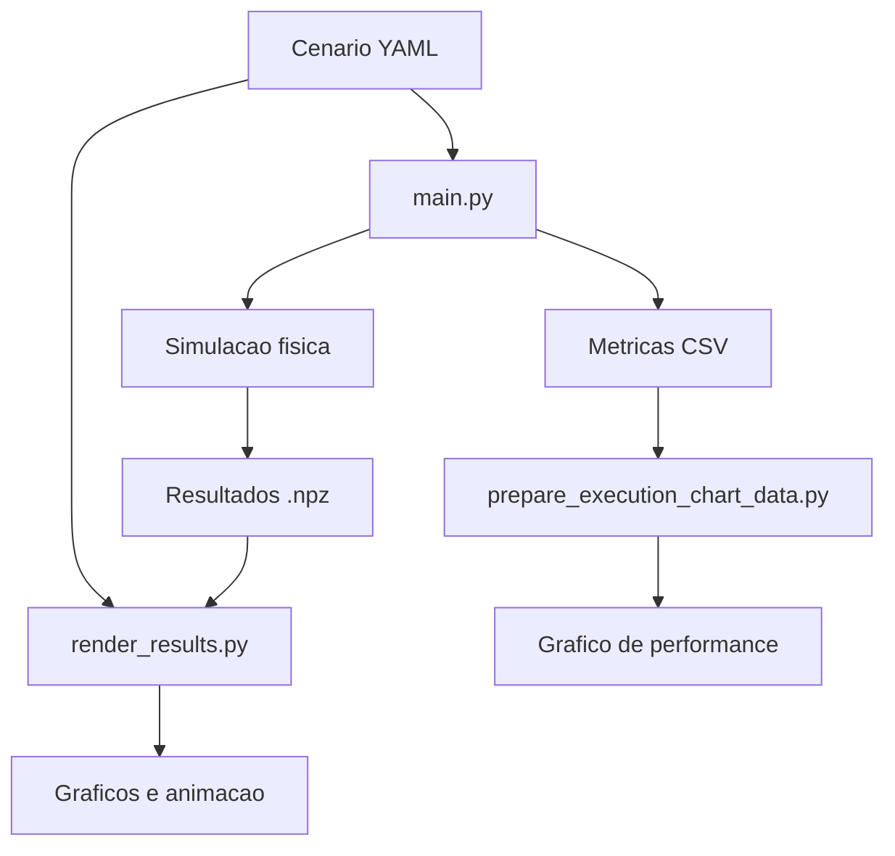

# Arquitetura

## Visão geral

## Papéis dos módulos

- `main.py`: orquestra a execução de um cenário, chama a simulação, salva os resultados físicos e registra métricas.
- `src/simulacao.py`: monta condições iniciais, discretiza o tempo e integra o sistema físico com `solve_ivp`.
- `src/calculos.py`: implementa a equação de dois corpos, massa no tempo e cálculos físicos auxiliares.
- `src/utils.py`: carrega YAML dos cenários e padroniza caminhos de saída.
- `render_results.py`: reabre um resultado `.npz` salvo e delega a renderização.
- `src/plot.py`: gera gráfico estático e exporta animação a partir das séries físicas.
- `src/performance_metrics.py`: mede tempo/CPU/memória e persiste o histórico em CSV.
- `src/prepare_execution_chart_data.py`: transforma o CSV de métricas em TSV para o `gnuplot`.
- `execution_metrics.gnuplot`: renderiza o PNG com o histórico das execuções.
