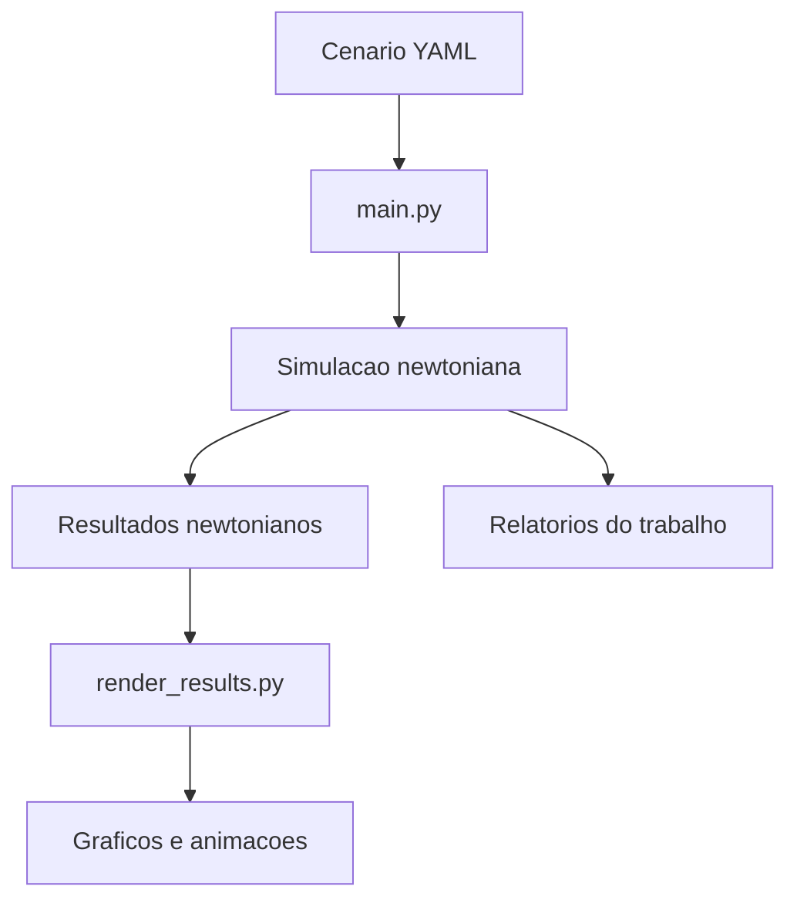

# Arquitetura

## Visão geral

## Papéis dos módulos

- `main.py`: executa cada cenário apenas no formalismo `newtonian`.
- `src/simulacao.py`: monta o estado inicial e integra o sistema com `solve_ivp`.
- `src/calculos.py`: concentra as equações físicas, energia, momento linear e momento angular.
- `src/analysis.py`: gera o relatório do trabalho com as métricas de conservação da execução newtoniana.
- `src/performance_metrics.py`: mede tempo, CPU e memória e salva um CSV do fluxo newtoniano.
- `render_results.py`: lê o `.npz` newtoniano e delega a renderização.
- `src/plot.py`: gera gráfico estático e animação.
- `src/prepare_execution_chart_data.py` + `execution_metrics.gnuplot`: transformam o CSV em gráfico histórico de benchmark.
- `src/utils.py`: centraliza carga de YAML e caminhos de saída em `outputs/`.
